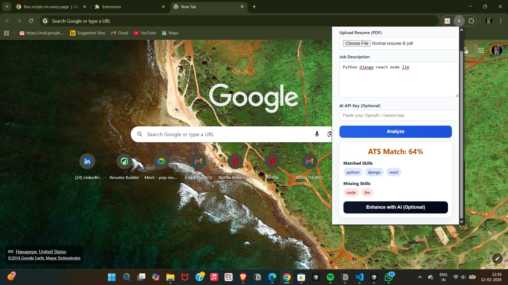
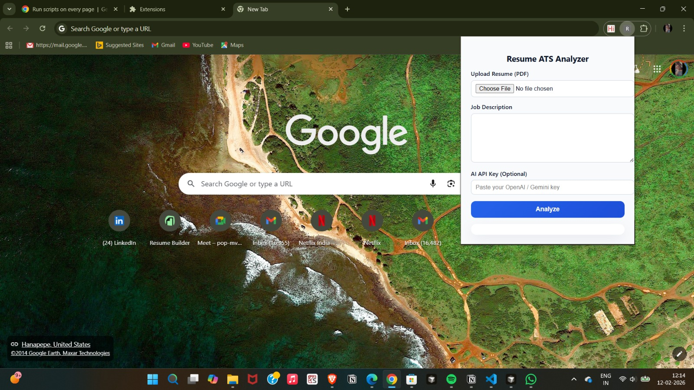

<div align="center">

# 📄 Resume ATS Analyzer

### AI-Powered Chrome Extension for Resume Optimization

[](https://github.com/roshaldsouza/resume-ats-analyzer)
[](https://opensource.org/licenses/MIT)
[](https://www.javascript.com/)

[Features](#-features) • [Demo](#-demo) • [Installation](#-installation) • [Usage](#-how-to-use) • [Architecture](#-architecture)

</div>

---

## 🎯 Overview

**Resume ATS Analyzer** is a privacy-first Chrome extension that helps job seekers optimize their resumes by simulating how Applicant Tracking Systems (ATS) evaluate applications. Get instant feedback on your resume's compatibility with job descriptions—completely offline and secure.

### Why This Extension?

- 🎯 **Realistic ATS Simulation** - Not just keyword matching; uses weighted scoring algorithms
- 🔒 **Privacy-First** - Everything runs locally; your resume never leaves your device
- 🤖 **Optional AI Enhancement** - Opt-in AI features with your own API key
- 💰 **Cost-Effective** - No subscriptions, no hidden fees
- ⚡ **Instant Results** - Get match scores in seconds

---

## ✨ Features

### Core Functionality
- ✅ **PDF Resume Upload** - Drag-and-drop or click to upload
- ✅ **Job Description Analysis** - Paste any job posting
- ✅ **ATS Match Score** - Percentage-based compatibility rating
- ✅ **Skill Gap Analysis** - See matched vs. missing skills at a glance
- ✅ **Weighted Scoring** - Prioritizes technical skills over generic keywords
- ✅ **Offline-First** - Works without internet connection

### AI-Powered Enhancements (Optional)
- 🤖 **Smart Suggestions** - AI-recommended skills to add
- ✍️ **Bullet Point Rewriter** - Improve resume language and impact
- 💡 **Tailoring Tips** - Personalized optimization advice
- 🔐 **Secure API Usage** - Your API key stored locally, never shared

### User Experience
- 🎨 **Modern UI** - Clean, intuitive interface with smooth animations
- 📱 **Responsive Design** - Works seamlessly at any browser size
- 🌙 **Dark Mode Ready** - Easy on the eyes during late-night job searches
- ⚡ **Fast Performance** - Instant analysis, no loading delays

---

## 📸 Demo

### Main Analysis View

*Real-time ATS scoring with skill breakdown and match percentage*

### Skill Gap Visualization
*Visual comparison of matched skills vs. missing keywords*


### dashboard

*dashboard*


## 🚀 Installation

### Option 1: From Chrome Web Store (Coming Soon)
```
🔜 Extension currently in review process
```

### Option 2: Load Unpacked (Developer Mode)

1. **Clone the repository**
```bash
   git clone https://github.com/roshaldsouza/resume-ats-analyzer.git
   cd resume-ats-analyzer
```

2. **Open Chrome Extensions**
   - Navigate to `chrome://extensions/`
   - Enable **Developer Mode** (toggle in top-right corner)

3. **Load the extension**
   - Click **"Load unpacked"**
   - Select the project folder
   - The extension icon should appear in your toolbar

4. **Pin for easy access** (Optional)
   - Click the puzzle piece icon in Chrome
   - Pin "Resume ATS Analyzer" to toolbar

---

## 📖 How to Use

### Basic ATS Analysis

1. **Open the extension**
   - Click the extension icon in your Chrome toolbar

2. **Upload your resume**
   - Drag and drop your PDF resume, or click to browse
   - Supported format: `.pdf` (up to 5MB)

3. **Paste job description**
   - Copy the full job posting
   - Paste into the text area

4. **Get instant analysis**
   - View your ATS match score
   - Review matched skills (green)
   - Identify missing keywords (red)

### AI Enhancement (Optional)

1. **Add your API key** (one-time setup)
   - Click "Settings" → "AI Configuration"
   - Enter your OpenAI API key
   - Keys are stored locally using `chrome.storage`

2. **Enable AI features**
   - Click "Enhance with AI" button
   - Review AI-generated suggestions
   - Apply recommended changes to your resume

> **Privacy Note:** AI features are opt-in. Your resume is only sent to OpenAI when you explicitly click "Enhance with AI."

## 🏗 Architecture

### System Design
```
┌─────────────────────────────────────────────────────────┐
│                     Chrome Extension                     │
├─────────────────────────────────────────────────────────┤
│                                                           │
│  ┌─────────────┐      ┌──────────────┐                  │
│  │   PDF.js    │─────▶│ Text Extract │                  │
│  │   Parser    │      │   & Clean    │                  │
│  └─────────────┘      └──────┬───────┘                  │
│                              │                           │
│                              ▼                           │
│                    ┌─────────────────┐                   │
│                    │  ATS Algorithm  │                   │
│                    │  • Tokenization │                   │
│                    │  • Matching     │                   │
│                    │  • Scoring      │                   │
│                    └────────┬────────┘                   │
│                             │                            │
│                             ▼                            │
│                    ┌─────────────────┐                   │
│                    │  Score + Gaps   │                   │
│                    │   Visualization │                   │
│                    └────────┬────────┘                   │
│                             │                            │
│             ┌───────────────┴──────────────┐             │
│             ▼                              ▼             │
│   ┌──────────────────┐          ┌──────────────────┐    │
│   │  Display Results │          │  AI Enhancement  │    │
│   │   (Offline)      │          │   (Optional)     │    │
│   └──────────────────┘          └──────────────────┘    │
│                                          │               │
│                                          ▼               │
│                                  ┌──────────────┐        │
│                                  │  OpenAI API  │        │
│                                  │ (User's Key) │        │
│                                  └──────────────┘        │
└─────────────────────────────────────────────────────────┘
```

### Core Components

#### 1. **Resume Parsing**
```javascript
// Client-side PDF text extraction
import * as pdfjsLib from 'pdf.js';
// No file uploads, no external servers
```

#### 2. **Text Preprocessing**
- Lowercasing and normalization
- Stop word removal
- Technical term preservation
- Whitespace cleanup

#### 3. **ATS Scoring Engine**

| Keyword Category | Weight | Examples |
|-----------------|--------|----------|
| Core Technical Skills | **High (3x)** | Python, React, Machine Learning |
| Tools & Technologies | **Medium (2x)** | Git, Docker, AWS |
| Soft Skills / Generic | **Low (1x)** | Communication, Team Player |

**Formula:**
```
ATS Score = (Σ Matched Keyword Weights / Σ Total Keyword Weights) × 100
```

#### 4. **AI Integration Layer**
- Triggered only on user action
- Uses Fetch API to call OpenAI-compatible endpoints
- Implements retry logic and error handling
- No automatic API calls

---

## 🛠 Tech Stack

| Category | Technologies |
|----------|-------------|
| **Frontend** | HTML5, CSS3, Vanilla JavaScript (ES6+) |
| **Extension** | Chrome Extensions API (Manifest V3) |
| **PDF Processing** | PDF.js (Mozilla) |
| **Storage** | Chrome Storage API |
| **AI (Optional)** | OpenAI API / Compatible Services |
| **Build Tools** | None (pure client-side) |

---

## 🧮 ATS Scoring Strategy

### Keyword Extraction Logic
```javascript
const skillWeights = {
  'machine learning': 3,
  'python': 3,
  'react': 3,
  'docker': 2,
  'git': 2,
  'communication': 1,
  'team player': 1
};
```

### Matching Algorithm

1. **Extract** keywords from job description
2. **Normalize** resume text (remove special chars, lowercase)
3. **Match** keywords against resume content
4. **Calculate** weighted score
5. **Identify** skill gaps

### Why Weighted Scoring?

Traditional ATS keyword matching treats all terms equally. Our weighted system:
- Prioritizes hard skills over soft skills
- Values specific technologies higher
- Reduces false positives from generic terms
- Better reflects real ATS behavior

---

## 🔒 Privacy & Security

### What We DON'T Do
- ❌ Upload your resume to any server
- ❌ Store your data in the cloud
- ❌ Track your usage with analytics
- ❌ Share your API keys
- ❌ Require account creation

### What We DO
- ✅ Process everything locally in your browser
- ✅ Store API keys encrypted in Chrome storage
- ✅ Work completely offline (except optional AI)
- ✅ Use Manifest V3 security standards
- ✅ Open source for full transparency

### Data Flow
```
Your Resume → Browser Memory → Analysis → Display → Cleared
     ↓
  Never leaves your device (unless you enable AI)
```

---

## 🎯 Use Cases

- 💼 **Job Seekers** - Optimize resumes before applying
- 🎓 **Students** - Tailor resumes for internships
- 👨‍💻 **Developers** - Understand ATS systems technically
- 📊 **Career Coaches** - Help clients improve resume matching
- 🔄 **Career Switchers** - Identify skill gaps for new roles

---

## 🗺 Roadmap

- [ ] Multi-file resume comparison
- [ ] Resume template suggestions
- [ ] LinkedIn profile import
- [ ] Cover letter analysis
- [ ] Browser action quick analysis
- [ ] Export analysis as PDF report
- [ ] Support for .docx files
- [ ] Chrome Web Store publication

---

## 🤝 Contributing

Contributions are welcome! Here's how you can help:

1. **Fork** the repository
2. **Create** a feature branch (`git checkout -b feature/AmazingFeature`)
3. **Commit** your changes (`git commit -m 'Add some AmazingFeature'`)
4. **Push** to the branch (`git push origin feature/AmazingFeature`)
5. **Open** a Pull Request

### Development Setup
```bash
# Clone your fork
git clone https://github.com/YOUR_USERNAME/resume-ats-analyzer.git

# Create a branch
git checkout -b feature/your-feature

# Make changes and test in Chrome
# Load unpacked extension and test

# Commit and push
git add .
git commit -m "Description of changes"
git push origin feature/your-feature
```

---

## 📄 License

This project is licensed under the **MIT License** - see the [LICENSE](LICENSE) file for details.
```
MIT License - Free to use, modify, and distribute
```

---

## 🙌 Author

**Roshal Dsouza**

Computer Science | Full Stack Developer | AI Enthusiast

- 💼 LinkedIn: [roshal-dsouza-571910228](https://www.linkedin.com/in/roshal-dsouza-571910228/)
- 💻 GitHub: [@roshaldsouza](https://github.com/roshaldsouza)
- 📧 Email: [Contact via LinkedIn]

---

## 🌟 Acknowledgments

- **PDF.js** by Mozilla for excellent PDF parsing
- **Chrome Extensions** team for comprehensive documentation
- **OpenAI** for AI API capabilities
- Job seekers worldwide for inspiration

---

## ⭐ Show Your Support

If this project helped you land an interview, give it a ⭐!

<div align="center">

**[⬆ Back to Top](#-resume-ats-analyzer)**

Made with ❤️ for job seekers everywhere

</div>


